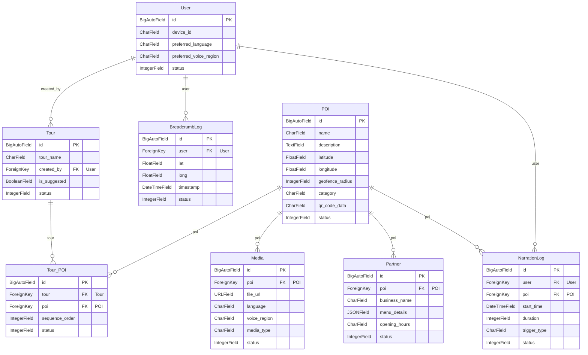

# Entity Relationship Diagram (ERD) - BuocChanSoiDa

Sơ đồ ERD dưới đây được thiết kế và điều chỉnh lại để phù hợp với quy chuẩn đặt tên và kiểu dữ liệu của Django ORM.

## Sơ đồ Mermaid (Django Models)

## Chi tiết các Models

### 1. User
Lưu trữ thông tin người dùng (sử dụng User model tùy chỉnh nếu thiết bị là định danh chính).
- `id`: `BigAutoField` (Primary Key tự sinh)
- `device_id`: `CharField` (Mã định danh thiết bị duy nhất)
- `preferred_language`: `CharField` (Ngôn ngữ ưa thích)
- `preferred_voice_region`: `CharField` (Giọng đọc vùng miền ưu tiên)
- `status`: `IntegerField` (hoặc `SmallIntegerField` với `choices`)

### 2. POI (Điểm tham quan)
- `id`: `BigAutoField` (Primary Key)
- `name`: `CharField`
- `description`: `TextField` (Thay vì string để phù hợp với văn bản dài)
- `latitude`: `FloatField` (Thay vì double)
- `longitude`: `FloatField` (Thay vì double)
- `geofence_radius`: `IntegerField`
- `category`: `CharField`
- `qr_code_data`: `CharField`
- `status`: `IntegerField`

### 3. Tour (Hành trình)
- `id`: `BigAutoField` (Primary Key)
- `tour_name`: `CharField`
- `created_by`: `ForeignKey(User)` (Khóa ngoại trỏ đến User)
- `is_suggested`: `BooleanField`
- `status`: `IntegerField`

### 4. Tour_POI (Bảng nối ManyToMany)
Được sử dụng làm bảng trung gian (`through` model) cho quan hệ giữa `Tour` và `POI`. Thay vì sử dụng composite key như trong ảnh, Django sẽ tự động sinh trường `id` cho class này. Có thể dùng `constraints` (`UniqueConstraint`) trong meta class để ràng buộc tính duy nhất cho cặp `(tour, poi)`.
- `id`: `BigAutoField` (Primary Key)
- `tour`: `ForeignKey(Tour)`
- `poi`: `ForeignKey(POI)`
- `sequence_order`: `IntegerField` (Thứ tự của POI trong hành trình)
- `status`: `IntegerField`

### 5. Media (Phương tiện âm thanh/hình ảnh)
- `id`: `BigAutoField` (Primary Key)
- `poi`: `ForeignKey(POI, related_name='media')`
- `file_url`: `URLField` (hoặc `FileField`/`CharField` tuỳ cách file được lưu trữ)
- `language`: `CharField`
- `voice_region`: `CharField`
- `media_type`: `CharField`
- `status`: `IntegerField`

### 6. Partner (Đối tác/Nhà hàng tại POI)
- `id`: `BigAutoField` (Primary Key)
- `poi`: `ForeignKey(POI, related_name='partners')`
- `business_name`: `CharField`
- `menu_details`: `JSONField` (Phù hợp với kiểu dữ liệu JSON)
- `opening_hours`: `CharField`
- `status`: `IntegerField`

### 7. BreadcrumbLog (Lộ trình di chuyển của User)
- `id`: `BigAutoField` (Primary Key)
- `user`: `ForeignKey(User, related_name='breadcrumbs')`
- `lat`: `FloatField`
- `long`: `FloatField`
- `timestamp`: `DateTimeField`
- `status`: `IntegerField`

### 8. NarrationLog (Lịch sử nghe Audio/Scan QR của User)
- `id`: `BigAutoField` (Primary Key)
- `user`: `ForeignKey(User, related_name='narration_logs')`
- `poi`: `ForeignKey(POI, related_name='narration_logs')`
- `start_time`: `DateTimeField`
- `duration`: `IntegerField` (Thời gian lấy theo giây hoặc phút tùy cấu hình)
- `trigger_type`: `CharField` (Với `choices` như `Auto`, `QR`)
- `status`: `IntegerField`
