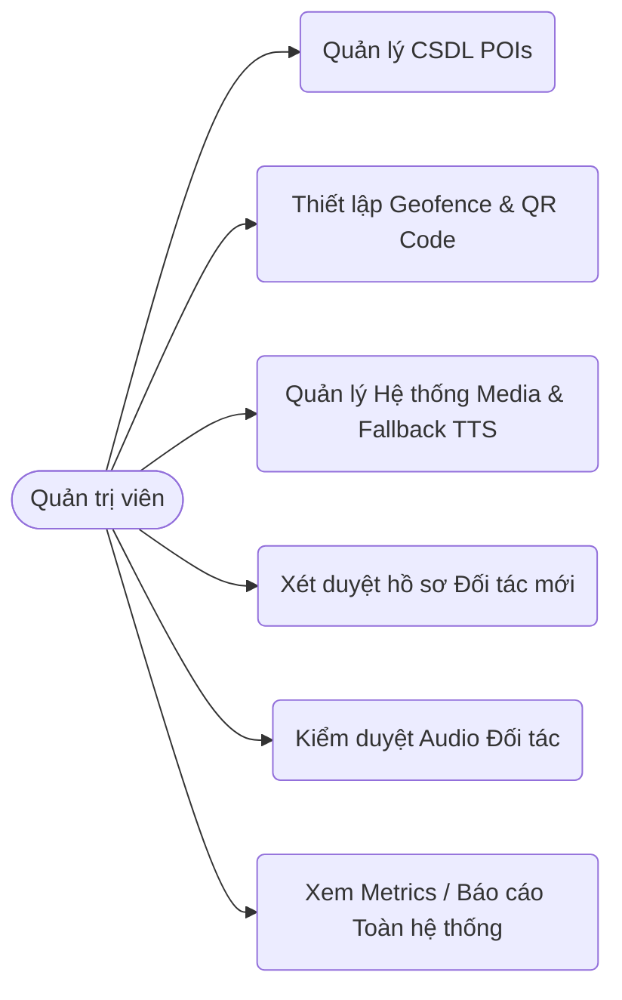
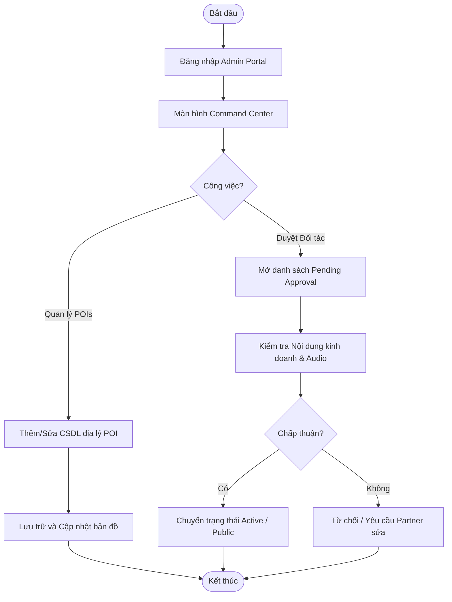
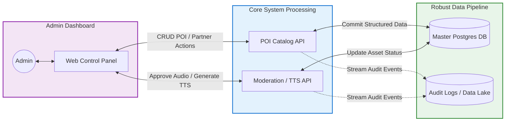

# Product Requirements Document (PRD) - Admin Portal

## 1. Tổng quan (Overview)
Portal dành cho Ban quản trị viên siêu việt hệ thống "Bước Chân Sỏi Đá". Platform cung cấp bộ công cụ tối cao (Command Center) để quản lý toàn bộ cấu trúc dữ liệu cơ sở về các Điểm tham quan (POIs), phân phối âm thanh thông minh và giám sát hệ thống Đối tác (Partners) một cách toàn diện.

## 2. Đối tượng sử dụng
Quản trị viên hệ thống (Super Admin), Chuyên viên phát triển du lịch, Bộ phận kiểm duyệt hoặc Nhân sự nhập liệu content.

## 3. Tính năng chính (Key Features)

### 3.1 Quản lý Điểm Tham Quan cốt lõi (POIs Management)
- **Quản trị cơ sở dữ liệu vĩ mô:** Thêm/Sửa/Xóa và chuẩn hóa thông tin tên địa điểm, mô tả và kho danh mục POI.
- **Thiết lập bản đồ định vị:** Hiệu chỉnh vĩ độ (Latitude), kinh độ (Longitude) và thiết lập bán kính kích hoạt tự động (Geofence radius - ví dụ: 50m) phục vụ mô hình tiếp nhận thông tin thụ động (Narration Engine).
- **Mã hóa QR Code:** Ghi nhận và tổ chức dữ liệu gắn trên QR Code trỏ vào POI tại điểm vật lý.
- **Trạng thái vòng đời POI:** Quản trị trạng thái kích hoạt (Active) hoặc đóng (Inactive) các khu di tích/tham quan trên ứng dụng End-User.

### 3.2 Quản trị Động cơ Trình diễn Media (Media Engine)
- **Phân luồng Media Đa hình:** Tích hợp Audio thu âm sẵn truyền thống và nội dung Auto TTS dựa vào text mô tả.
- **Cấu hình Ngôn ngữ/Vùng giọng:** Gán và phân loại các bản media chuẩn hóa với thư viện mã ngôn ngữ quốc tế và phương ngữ đặc trưng (Bắc-Trung-Nam, Anh-Mỹ).
- **Fallback Rule Control:** Hệ thống sẽ chạy cơ chế quét ưu tiên - tìm file Audio match chính xác -> tìm fallback ngôn ngữ -> Chạy tạo TTS thời gian thực nếu kịch bản kia thiếu, đảm bảo hành trình user không bị gián đoạn thính giác.

### 3.3 Giám sát Đối tác Kinh Doanh (Partner Moderation)
- **Quy trình kiểm duyệt Onboarding:** Sàng lọc và phê duyệt trạng thái đối tác tham gia (Chuyển đổi trạng thái từ Pending Approval sang Active hoặc Reject nếu thông tin lỗi).
- **Quản lý Media giới thiệu (Intro Media):** Cấp phép hệ thống file âm thanh tự giới thiệu thuộc doanh nghiệp partner để đảm bảo tuân thủ tiêu chuẩn và văn hóa điểm đến.
- **Phân bổ vị trí chiến lược:** Map chính xác từng Partner vào cụm sinh thái xung quanh một POI cụ thể, đảm bảo gợi ý đúng ngữ cảnh kinh tế.

### 3.4 Báo cáo tương tác trung tâm (Centralized Interaction Logging)
- **Metrics Phân tích người dùng:** Xem tổng quan tần suất người dùng qua lại các POI dựa trên tương tác ẩn danh và định danh.
- **Theo dõi đối tác bao trùm:** Báo cáo chi tiết số lượng impression, click, request chỉ đường do người dùng tác động với Partner trong mạng lưới.
- **Hệ thống Nhật ký (Logs):** Bao hàm truy vết các chỉnh sửa, cập nhật cấu hình hệ thống bởi nội bộ ban quản trị viên.

## 4. Yêu cầu phi chức năng (Non-functional Requirements)
- **Khả năng chiụ tải lớn (Scalability):** Hệ thống có chuẩn cấu trúc ORM linh hoạt, đáp ứng khả năng duyệt nhanh qua hàng ngàn điểm địa lý.
- **Index dữ liệu mượt mà:** Khả năng truy xuất bằng Index đa trường (e.g. theo ngôn ngữ vùng giọng hoặc timestamp) cho chức năng báo cáo và hiển thị tức thời.
- **Phân quyền chặt chẽ:** Bảo mật hạ tầng ở cấp độ View/Edit phân quyền tài khoản cho nhóm Data Entry và nhóm Superadmin.

## 5. Use Case & Activity Diagram

### 5.1 Use Case Diagram (Admin)
Các quyền hạn quản trị tối cao của Admin.

### 5.2 Activity Diagram (Admin: Reviewing Partners & Media)
Luồng duyệt hồ sơ Đối tác và quản lý vận hành.

### 5.3 Sequence Diagram (Admin: Create POIs & Create/Link Partner)

## 6. System Architecture Flow (Operational Flow)
Sơ đồ quản lý dữ liệu ứng dụng (Application Data Management) và luồng duyệt nội dung của Admin.

