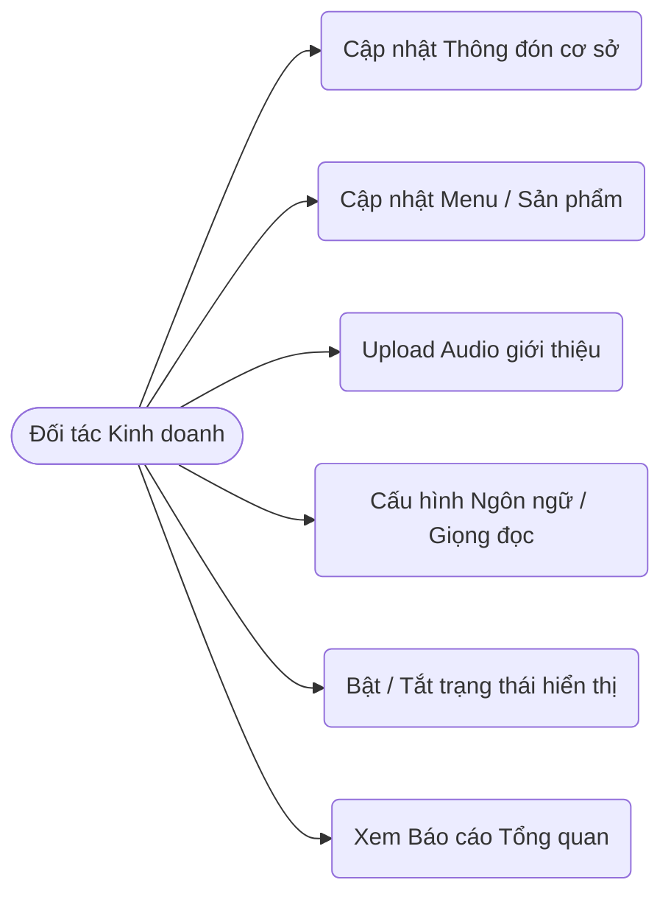
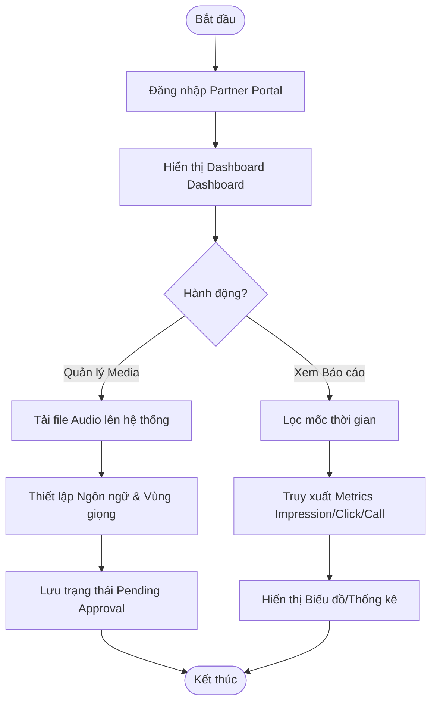
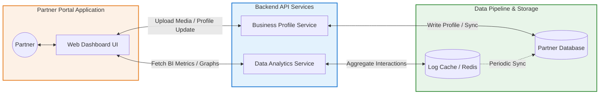

# Product Requirements Document (PRD) - Partner Portal

## 1. Tổng quan (Overview)
Portal quản trị dành cho Đối tác (Partner) như các hộ kinh doanh, nhà hàng, cửa hàng mua sắm, hoặc dịch vụ du lịch liên kết gắn với các POI. Hệ thống giúp đối tác quảng bá hình ảnh, dịch vụ của mình đến tệp khách du lịch đang trực tiếp tham quan trong khu vực và đo lường trực tiếp quá trình chuyển đổi.

## 2. Đối tượng sử dụng
Chủ doanh nghiệp, chuyên viên quản lý cơ sở kinh doanh lân cận hoặc có ký kết tham gia hệ sinh thái các điểm tham quan của "Bước Chân Sỏi Đá".

## 3. Tính năng chính (Key Features)

### 3.1 Quản lý hồ sơ doanh nghiệp (Business Profile)
- **Thiết lập thông tin hoạt động:** Cập nhật Tên cơ sở kinh doanh, thời gian/giờ mở cửa.
- **Quản lý Menu & Sản phẩm tiêu biểu:** Trình bày chi tiết menu và sản phẩm sử dụng cấu trúc linh hoạt (đưa ra các món "must_try", mô tả khoảng giá trung bình "price_range"...) giúp kích thích khách du lịch.

### 3.2 Quản lý Media giới thiệu đa ngôn ngữ (Intro Media)
- **Đăng tải âm thanh giới thiệu:** Tự do quản lý và tải lên file audio/radio giới thiệu về dịch vụ của doanh nghiệp mình, tiếp cận thính giác của khách khi họ lướt danh sách.
- **Bản địa hóa trải nghiệm nội dung:** Cho phép Partner phát hành cùng lúc nhiều file audio nhằm hỗ trợ đa ngôn ngữ (vi, en, ja...) và nhắm mục tiêu giọng đọc khác nhau (miền Bắc, Nam, Trung) để phục vụ sát nhất chân dung khách du lịch tiềm năng.
- **Cập nhật trạng thái hiển thị:** Chủ động Bật/Tắt (Active/Inactive) từng file media cho những chiến dịch truyền thông phù hợp.

### 3.3 Phân tích & Báo cáo hiệu quả kinh doanh (Analytics & Attribution)
- **Báo cáo lượt xem:** Đo lường tổng số lượng lượt hiển thị thẻ dịch vụ trên ứng dụng (Impressions) khi du khách tới gần POI.
- **Đo lường sự quan tâm:** Thống kê chi tiết lượt nhấp vào xem thông tin và menu (Clicks).
- **Theo dõi tỷ lệ chuyển đổi trực tiếp:** Số liệu chính xác về các Call-to-action bao gồm lượt lấy chỉ đường (Direction), số lượng nhấn gọi điện trực tiếp (Call), và lượng traffic truyền tải truy cập trang web (Website).
- **Lịch sử tương tác ẩn danh:** Tính toán truy suất ngay cả với nhóm người dùng không đăng nhập để cho ra phân tích thị trường toàn diện.

## 4. Yêu cầu phi chức năng (Non-functional Requirements)
- **Sáng sủa, thân thiện thiết bị di động:** Giao diện Dashboard cần tối giản, số liệu trực quan, phục vụ tốt cho đối tượng kinh doanh không rành công nghệ.
- **Quy trình xét duyệt chuẩn hóa:** Nhất quán quy trình trạng thái (Pending Approval -> Active) minh bạch cho các doanh nghiệp lần đầu tham gia.
- **Bảo mật và riêng tư:** Dữ liệu kinh doanh và chuyển đổi khách hàng chỉ hiển thị và báo cáo độc quyền cho chính đối tác đó.

## 5. Use Case & Activity Diagram

### 5.1 Use Case Diagram (Partner)
Các chức năng chính mà đối tác có thể thực hiện trên Portal.

### 5.2 Activity Diagram (Partner: Upload Media & Monitor)
Luồng hoạt động tải lên file âm thanh và theo dõi thống kê.

### 5.3 Activity Diagram (Partner: Register/Login & View Info)

## 6. System Architecture Flow (Operational Flow)
Sơ đồ luồng hệ thống cấu trúc 3 lớp, mô tả dòng chảy dữ liệu (Data Pipeline) của đối tác.

