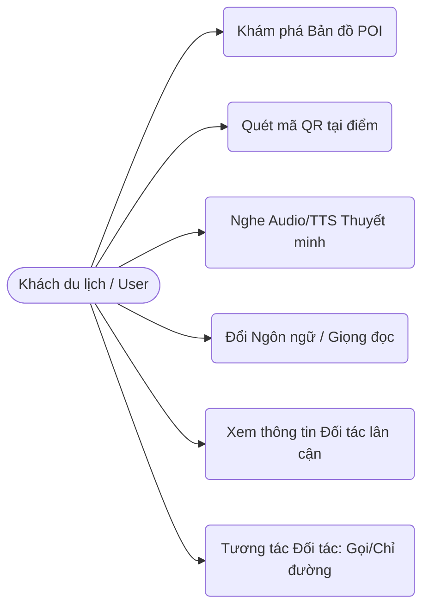
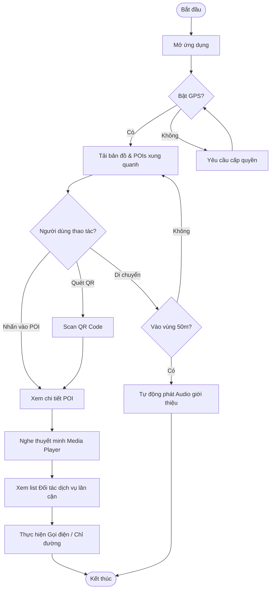

# Product Requirements Document (PRD) - User Portal

## 1. Tổng quan (Overview)
Ứng dụng "Bước Chân Sỏi Đá" cung cấp trải nghiệm du lịch số hóa, cho phép người dùng khám phá các điểm tham quan (POI) thông qua bản đồ tương tác, quét mã QR và hệ thống thuyết minh tự động đa ngôn ngữ, đa tuyến giọng vùng miền.

## 2. Đối tượng sử dụng (Target Audience)
Khách du lịch tự túc, khách tham quan có nhu cầu tìm hiểu sinh động về các địa danh, lịch sử và văn hóa địa phương một cách độc lập mà không cần hướng dẫn viên trực tiếp.

## 3. Tính năng chính (Key Features)

### 3.1 Khám phá điểm tham quan (Map Explore & Guided Tour)
- **Xem bản đồ POI:** Hiển thị vị trí các điểm tham quan xung quanh trên bản đồ số trực quan.
- **Tính toán khoảng cách & Chỉ đường:** Tự động tính khoảng cách thực tế từ vị trí hiện tại đến các POI thân cận.
- **Geofencing (Hàng rào địa lý):** Tự động nhận diện thiết bị khi người dùng bước vào bán kính của một POI (ví dụ: 50m) để nhắc nhở hoặc kích hoạt nội dung giới thiệu thông minh (Narration Engine).
- **Quét mã QR:** Nhanh chóng quét QR Code tại điểm tham quan để mở trực tiếp thông tin và bài thuyết minh chi tiết về địa danh.

### 3.2 Hệ thống thuyết minh độc quyền (Narration Engine)
- **Phát âm thanh / Audio TTS:** Truyền tải thông tin qua giọng đọc nhân tạo (Text-to-Speech) hoặc phát file âm thanh chân thực đã thu sẵn.
- **Hỗ trợ đa ngôn ngữ & Vùng miền:** Hỗ trợ đa dạng ngôn ngữ (vi, en, ja, ko...) và linh hoạt thay đổi giọng đọc theo vùng miền (giọng Bắc, Trung, Nam, US, UK...).
- **Media Player tích hợp:** Cung cấp trình điều khiển phát âm thanh linh hoạt với các chức năng tiếp tục, tạm dừng, tua thời gian và thay đổi tốc độ đọc.

### 3.3 Tương tác với đối tác dịch vụ lân cận (Partner Interaction)
- **Danh sách dịch vụ trải nghiệm:** Khám phá các đối tác kinh doanh (quán ăn đặc sản, cửa hàng lưu niệm, trạm dừng chân) được liên kết sinh thái với POI hiện tại.
- **Xem thông tin chi tiết:** Hiển thị tên cơ sở, chi tiết menu (mức giá "price_range", món nổi bật "must_try"), và giờ mở cửa để tiện lợi lên kế hoạch trải nghiệm.
- **Nghe giới thiệu thương hiệu:** Phát file audio tự giới thiệu của từng đối tác do chính họ cung cấp (hỗ trợ dịch thuật ngôn ngữ/giọng đọc tương ứng).
- **Tương tác nhanh chóng:** Kết nối 1 chạm qua thao tác gọi điện (Call), lấy chỉ đường (Direction), truy cập website (Website) của đối tác. Kích hoạt theo dõi hành vi thống kê cho hệ thống.

## 4. Yêu cầu phi chức năng (Non-functional Requirements)
- **Hiệu suất Media mạnh mẽ:** Audio có khả năng phát mượt mà dưới nền (background playback), đồng thời tương thích tốt với các rào cản chính sách bảo mật Auto-play của trình duyệt di động (ngừa chặn spam).
- **UX/UI cho Di động:** Ứng dụng tập trung 100% vào trải nghiệm trên thiết bị di động (Mobile-first design) thân thiện, các thao tác vuốt chạm chạm mượt mà.
- **Real-time Navigation:** Định vị vĩ độ/kinh độ GPS nhanh chóng và có tính xác thực cao khi tracking vị trí.

## 5. Use Case & Activity Diagram

### 5.1 Use Case Diagram (User)
Đại diện các tương tác chính của người dùng với hệ thống.

### 5.2 Activity Diagram (User: Explore POI & Play Audio)
Luồng hoạt động khám phá tham quan và nghe audio tự động.

